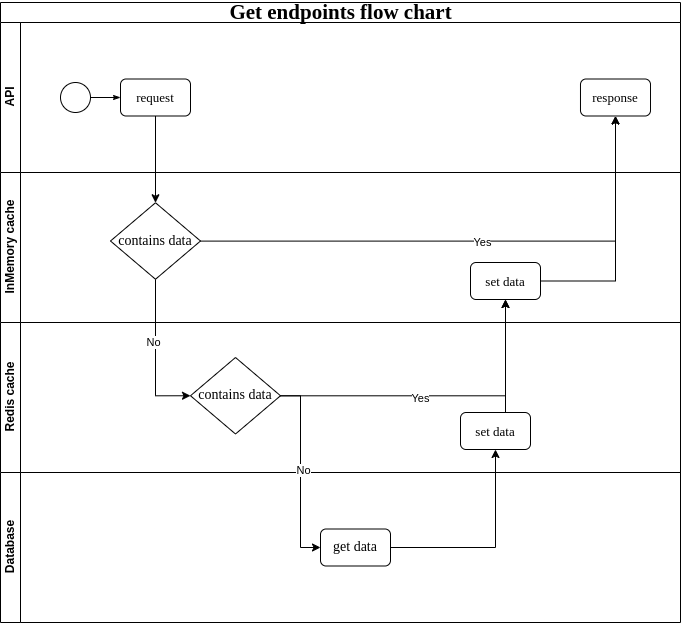
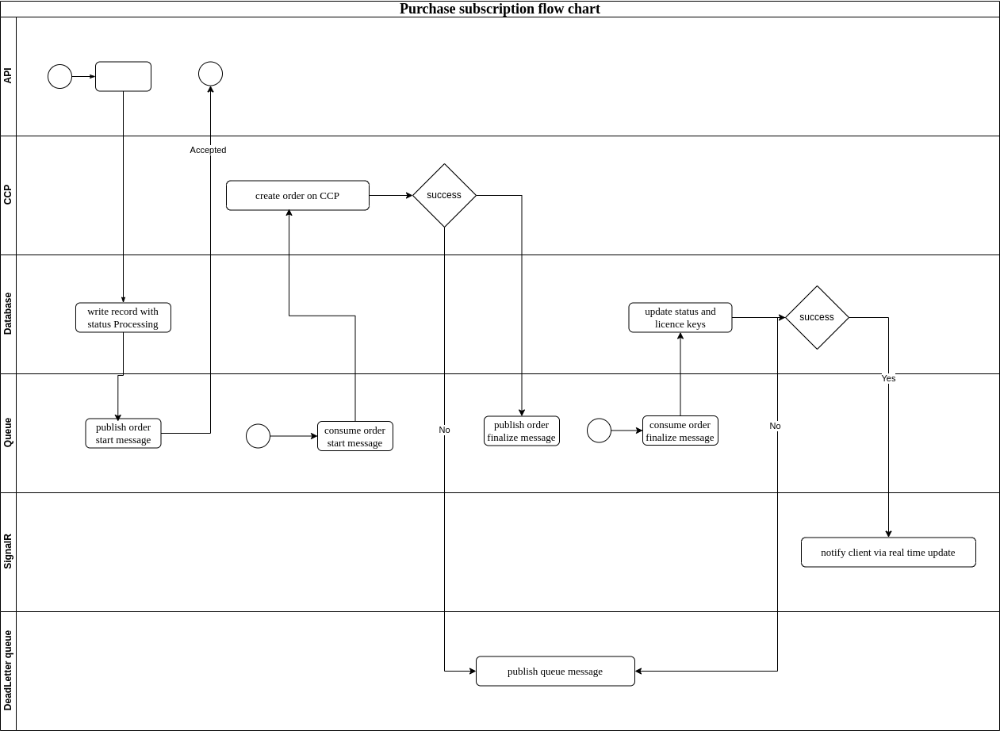

# Crayon

this repository contains solution for Technical Exercise and System Design Excercise.

## Technical excercise

directory structure:
* Crayon - contains source code for api
* Crayons.Tests - contains source code for test project

### Crayon API

Crayon API is an API written using .net9 framework in order to be solution of the technical exercise.

API uses MariaDB database as a main persistance layer software, Redis database for caching purposes and RabbitMQ for message quing.

#### Dependencies
* MariaDB
* Redis
* RabbitMQ

configuration for accessing these services can be changed in file appsettings.json inside Crayon directory.

Redis server needs to be configures with specific settings
```
notify-keyspace-events AKE
```

in order to receive notification about deleted keys from cache.
If you want to read more follow this [link](https://www.dejandjenic.com/blogs/caching-exploration-in-dotnet.html).

#### Mocking

Mocking of communication with CCP service is implemented by using [WireMock.net](https://github.com/WireMock-Net/WireMock.Net) library.


#### Authentication

System is configured with authentication (dummy authentication settings are configured in appsettings.json) but for production this needs to be changed with correct settings of OAuth server.
When this is configured correctly settings for ConfigureJWT in the same file needs to be set to false.
This settings is used to control adding of dummy JWT token configuration to API (API is protected by token even in development mode).
Stubbing authentication is done by using [TestJWTLibrary](https://www.dejandjenic.com/projects/testjwtlibrary/index.html)
When API is started default token is generated and printed to console output and can be used in consequtive requests.

#### SQL

SQL schema file is located in root of this repository and named Schema.sql.
Initial seeding script is localted in root of this repository and named Seed.sql.

when running locally for the fist time user needs to execute script for schema creation and optionally for seeding data.

#### Real time updates

API provides real time updates via SignalR implementation which is configured to use Redis backplane for SignalR and can be safely deployed in multi instance environment (Kubernetes , ...)


#### Flowcharts

**Get endpoint flow chart used in endpoints**

* /inventory
* /accounts
* /accounts/{id}/subscriptions
* /accounts/{id}/subscriptions/{subid}/licences

is displayed on image bellow




**Purchase order flowchart**



similar flow is used for all endpoints that change order data (cancel, change quantity and set expiration).


### Crayon tests

XUnit framework is used as main framework for test solution.

Main approach for testing was to create functional/integration tests ( [read more](https://learn.microsoft.com/en-us/aspnet/core/test/integration-tests?view=aspnetcore-9.0) ).

This approach doesn't exclude implementation of unit tests in the future.

#### TestContainers

In order to create functioanl tests and not to use local version of software (dependencies above) author chose [TestContainers](https://dotnet.testcontainers.org//) library.

During test setup docker containers are created (by using TestContainers library) for dependencies of the system (database, queue and redis).

#### Running tests
tests can be executed from Visual Studio / Rider or command line using 
```
dotnet test
```

Running tests locally assumes that docker is installed and configured correctly.

If tests are run on linux system you need to ensure that docker can be run in sudoless mode, if this is not the case please configure this settings by running command

```
sudo setfacl -m user:$USER:rw /var/run/docker.sock
```

During the setup phase of testing one container per dependency is started and after tests are finished those containers are stopped.
Test level isolation is implemented on database level by having different database for each tests.
During test database setup files Schema.sql and Seed.sql are used to configure both schema and initial data.

## System design excercise

directory system-design contains files related to the system design excercise.
